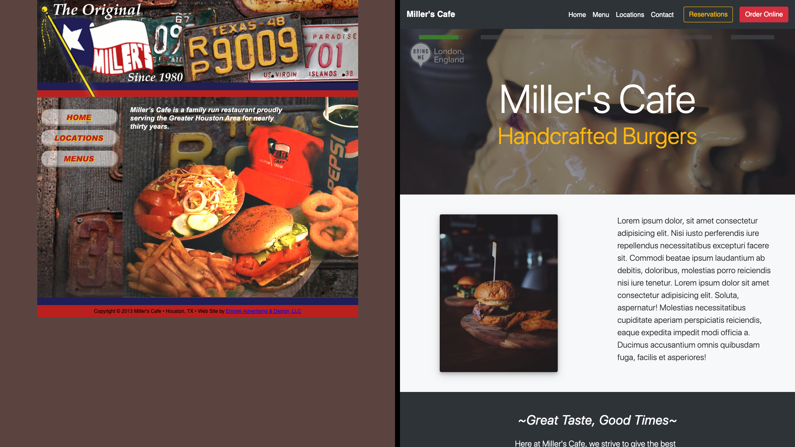

<h1>Restaurant Remake</h1>

Live Link:https://chris-humphrey.github.io/Burger-Restaurant-Remake/

<h2>Introduction</h2>
For this project, I searched locally for a restaurant's website that was outdated. I then crafted a single page website that emphasized the following:

* Ease of use and functionality.
* Updated design esthetic.
* Fully responsive.

## Key Technologies
 * HTML
 * CSS
 * Bootstrap

<h2>Comparison</h2>

To see the full code, please visit <a href="https://github.com/Chris-Humphrey/Burger-Restaurant-Remake">Restaurant Remake</a> on Github.

<h2>Author</h2>
Chris Humphrey
